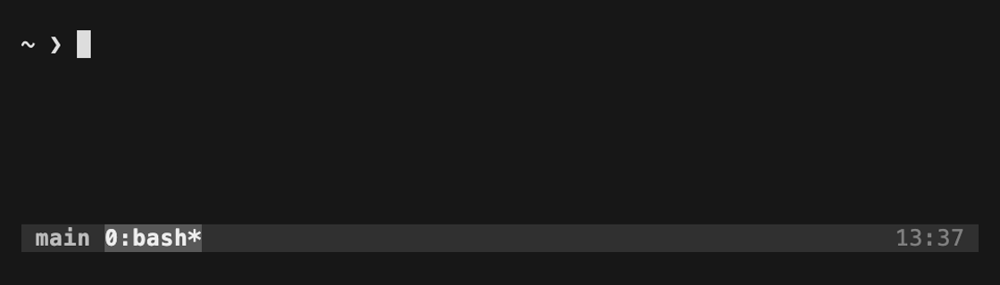

<div align="center">

# ☕ tmux-caffeinated

**A status-line indicator that shows when macOS `caffeinate` is keeping your Mac awake.**

[](https://github.com/eran-rom/tmux-caffeinated/actions/workflows/lint.yml)
[](LICENSE)




</div>

[`caffeinate`](https://ss64.com/mac/caffeinate.html) keeps your Mac awake on
demand, but it runs completely invisibly — no menu-bar icon, no indicator,
nothing on screen to tell you it's still holding your machine awake. Start it,
get distracted, and it quietly drains your battery and blocks sleep for hours.

**tmux-caffeinated** surfaces it where you'll actually notice: a high-contrast
pill in the tmux status line while `caffeinate` is running, and nothing at all
when it isn't. Pure Bash, zero dependencies, and the pill uses tmux's `reverse`
attribute so it adapts to any theme instead of clashing with it.

It's easiest to lose track of `caffeinate` exactly when you most rely on it:

- an AI coding agent is grinding through a long autonomous task,
- an unattended build, download, or render needs to finish,
- or you simply keep the machine up 24/7.

## Install

### [TPM](https://github.com/tmux-plugins/tpm) (recommended)

```tmux
set -g @plugin 'eran-rom/tmux-caffeinated'
set -g status-right '#{caffeinate_status} | %a %h-%d %H:%M '
```

Then press <kbd>prefix</kbd> + <kbd>I</kbd>.

### Manual

```sh
git clone https://github.com/eran-rom/tmux-caffeinated ~/.tmux/plugins/tmux-caffeinated
```

```tmux
set -g status-right '#{caffeinate_status} | %a %h-%d %H:%M '
run-shell ~/.tmux/plugins/tmux-caffeinated/caffeinate.tmux
```

The indicator refreshes every `status-interval` seconds (default 15); lower it
for snappier updates. The default coffee glyph and rounded ends need a
[Nerd Font](https://www.nerdfonts.com/) — without one, set a plain-text icon and
`@caffeinate_round 'off'`.

## Configuration

All options are optional tmux user options (defaults shown):

| Option | Default | Description |
| ------ | ------- | ----------- |
| `@caffeinate_on_icon`   | ` CAFFEINATED` | Icon/text shown while caffeinate is running. |
| `@caffeinate_on_style`  | `reverse,bold` | Style attributes for the pill (`reverse` = theme-adaptive). |
| `@caffeinate_round`     | `on`           | Rounded (`on`) or square (`off`) pill ends. |
| `@caffeinate_on_color`  | *(empty)*      | Explicit fg color; overrides `@caffeinate_on_style`. |
| `@caffeinate_off_icon`  | *(empty)*      | Icon/text shown while caffeinate is **not** running. |
| `@caffeinate_off_color` | *(empty)*      | Foreground color for the off icon. |

```tmux
# e.g. a coffee cup when awake, a sleeping face when idle
set -g @caffeinate_on_icon  '☕'
set -g @caffeinate_off_icon '😴'
```

## License

[MIT](LICENSE)
