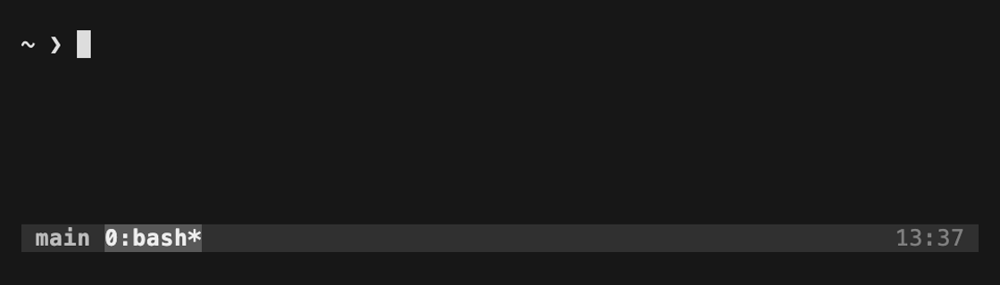

<div align="center">

# ☕ tmux-caffeinated

**A status-line indicator that shows when a keep-awake utility (macOS `caffeinate`, Linux `systemd-inhibit`/`caffeine`) is holding your machine awake.**

[](https://github.com/eran-rom/tmux-caffeinated/actions/workflows/lint.yml)
[](LICENSE)




</div>

[`caffeinate`](https://ss64.com/mac/caffeinate.html) keeps your Mac awake on
demand, and Linux has its own versions like `systemd-inhibit`. They all run
completely invisibly: no menu-bar icon, no indicator, nothing on screen to tell
you something's still holding your machine awake. Start one, get distracted, and
it quietly drains your battery and blocks sleep for hours.

**tmux-caffeinated** surfaces it where you'll actually notice: a high-contrast
pill in the tmux status line while a keep-awake utility is running, and nothing
at all when it isn't. Pure Bash, zero dependencies, and the pill uses tmux's
`reverse` attribute so it adapts to any theme instead of clashing with it.

It's easiest to lose track of it exactly when you most rely on it:

- an AI coding agent is grinding through a long autonomous task,
- an unattended build, download, or render needs to finish,
- or you simply keep the machine up 24/7.

## Install

### [TPM](https://github.com/tmux-plugins/tpm) (recommended)

```tmux
set -g @plugin 'eran-rom/tmux-caffeinated'
set -g status-right '#{caffeinate_status} %a %h-%d %H:%M '
```

Then press <kbd>prefix</kbd> + <kbd>I</kbd>.

### Manual

```sh
git clone https://github.com/eran-rom/tmux-caffeinated ~/.tmux/plugins/tmux-caffeinated
```

```tmux
set -g status-right '#{caffeinate_status} %a %h-%d %H:%M '
run-shell ~/.tmux/plugins/tmux-caffeinated/caffeinate.tmux
```

By default the indicator is just the pill, and nothing at all when nothing's
keeping the machine awake. If you want a divider between it and the rest of your
status line, set `@caffeinate_separator` (e.g. ` | `). It's printed only while
it's running, so it never lingers when it isn't. The indicator refreshes every
`status-interval` seconds (default 15); lower it for snappier updates. The
default coffee glyph and rounded ends need a
[Nerd Font](https://www.nerdfonts.com/). Without one, set `@caffeinate_on_text`
to plain text and `@caffeinate_round 'off'`.

On Linux the indicator looks for `systemd-inhibit` and `caffeine` out of the box.
To track a different inhibitor, point `@caffeinate_process` at its process name
(a `pgrep -x` pattern, `|`-separated for several).

## Configuration

All options are optional tmux user options (defaults shown):

| Option | Default | Description |
| ------ | ------- | ----------- |
| `@caffeinate_on_text`   | `CAFFEINATED`  | Text shown while a keep-awake utility is running. |
| `@caffeinate_on_style`  | `reverse,bold` | tmux style for the pill (`reverse` = theme-adaptive; or set `fg=`/`bg=` for fixed colors). |
| `@caffeinate_round`     | `on`           | Rounded (`on`) or square (`off`) pill ends. |
| `@caffeinate_separator` | *(empty)*      | Divider printed after the indicator, only while it's running (e.g. ` \| `). |
| `@caffeinate_off_text`  | *(empty)*      | Text shown while nothing is keeping the machine awake. |
| `@caffeinate_process`   | `caffeinate\|systemd-inhibit\|caffeine` | `pgrep -x` pattern of process names treated as "keeping awake". Override for other tools (e.g. add `\|gnome-session-i`). |

```tmux
# e.g. a coffee cup when awake, a sleeping face when idle
set -g @caffeinate_on_text  '☕'
set -g @caffeinate_off_text '😴'

# or a plain fixed-color label instead of the theme-adaptive pill
set -g @caffeinate_on_style 'fg=colour208,bold'
set -g @caffeinate_round    'off'
```

## License

[MIT](LICENSE)
